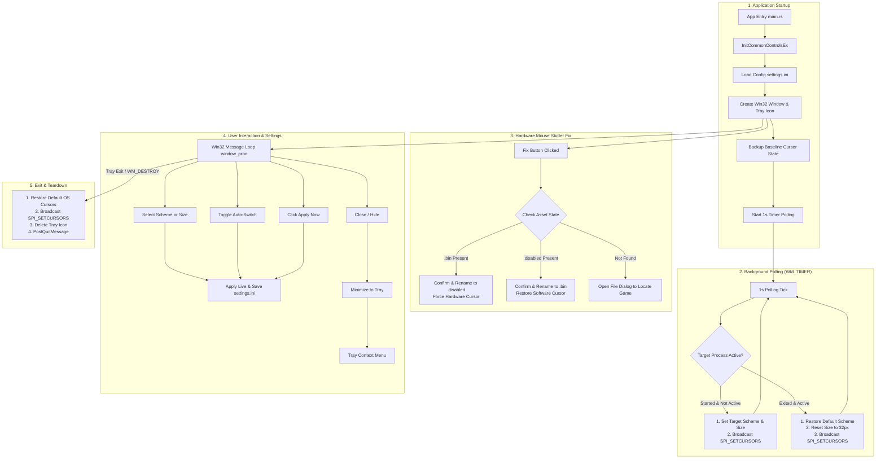

# Arknights Cursor Switcher

Lightweight native Windows utility to disable PRTS software cursor, fix mouse stuttering during loading screens, and auto-scale custom cursor schemes for Arknights PC Client, written in Rust with zero heavy GUI dependencies.

## Features

- **Disable PRTS Cursor & Fix Loading Screen Mouse Stutter**:
  - Fixes Arknights PC client software cursor lag and stuttering during loading screens by safely disabling `a9d41799f1af1868f2db495671227cd4.bin` in `StreamingAssets\AB\Windows\anon\`.
  - Toggles between disabled (`.bin.disabled` for smooth Windows hardware pointer) and active (`.bin` for default in-game software cursor).
  - Explicit confirmation dialog showing exact disk source/target paths before file modification.
  - Automatic game executable/directory detection with native Win32 file picker fallback.
- **Process Auto-Switch**: Automatically applies target cursor scheme and size scaling when `Arknights.exe` starts, then restores default cursors when the game exits.
- **Auto-Persisted Preferences**: Settings (`settings.ini`) auto-save immediately on any UI change (target process, scheme, size, auto-switch, game path) and restore on launch.
- **Scheme Enumeration**: Reads all available cursor schemes across user and system registry locations (`HKCU` user schemes, `HKLM` system schemes, and `HKLM Default Schemes`).
- **Live Scaling & Hot-Reload**: Dynamically scales cursor size from 32px to 112px (Scale 1–6) and broadcasts `SPI_SETCURSORS` for instant system-wide updates without logout or reboot.
- **System Tray Integration**: Minimize to notification area with tray icon, double-click to restore, and right-click context menu for quick switching and toggles.
- **Smooth GUI Controls**: Pure Win32 controls styled with Segoe UI and ComCtl32 v6 manifest integration for smooth combobox scrolling.
- **Clean Fallback & Restore**: Restores default Windows cursor configuration and accessibility scaling cleanly on exit or manual reset.

## PRTS Cursor & Loading Screen Stutter Fix Explained

The official Arknights PC client loads a custom Unity PRTS software cursor bundle:
```
Arknights_Data\StreamingAssets\AB\Windows\anon\a9d41799f1af1868f2db495671227cd4.bin
```

Because software cursors render inside the game loop, mouse movement freezes and stutters heavily whenever the game loads assets, switches scenes, or drops frames.

### The Fix
1. Renaming `a9d41799f1af1868f2db495671227cd4.bin` to `.bin.disabled` stops the software cursor bundle from loading.
2. Windows hardware cursor takes over immediately, providing 100% smooth, stutter-free mouse tracking at your monitor's full refresh rate even during heavy loading screens.
3. Clicking **"Disable PRTS Cursor"** performs this rename with confirmation.
4. Clicking **"Restore PRTS Cursor"** renames the file back to `.bin` whenever you want the default in-game cursor restored.

### Notes & Usage Tips

- **Client-Side Asset Toggle**: Simply renames an asset bundle on disk so Windows renders its native cursor. No memory injection, hooks, or executable modifications.
- **Direct Launch**: Run `Arknights.exe` directly (or via desktop shortcut) rather than the official launcher. The launcher's startup file verification may detect the renamed file and attempt to re-download it.

## Architecture Flow



## Configuration (`settings.ini`)

Settings are stored next to the executable in `settings.ini`:

```ini
target_process=Arknights.exe
scheme=Windows Aero
size=2
auto_switch=true
game_path=D:\YostarGames\Arknights\Arknights_Data\StreamingAssets\AB\Windows\anon
```

## Build & Run

### Prerequisites
- Windows 10 / 11
- Rust toolchain (`msvc` target recommended)

### Build Command

```sh
cargo build --release
```

Binary outputs to `target/release/ak-cursor-switcher.exe`.

## Tray Menu Actions

- **Open Window**: Restores the main settings window.
- **Auto-Switch Enabled**: Toggle background process monitoring.
- **Select Scheme**: Instant switch to any installed system or user cursor scheme.
- **Select Size**: Instant switch between Size 1 (32px) through Size 6 (112px).
- **Apply Now**: Force-applies currently selected GUI settings.
- **Restore Defaults**: Resets registry overrides back to Windows Default cursors.
- **Exit**: Restores default cursors, removes tray icon, and terminates process.
